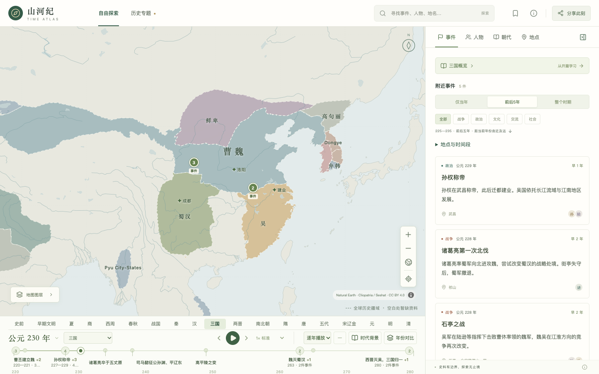

# 山河纪 · Time Atlas

**在地图上读历史，在时间中看山河。**

山河纪是一款以中国历史为主要阅读内容的交互历史地图。沿时间轴观察政权疆域，从事件读到人物与时代背景，也可以跟随有出处的年谱、专题和地点档案探索历史。

**[在线体验](https://history.zhaoguhong.com/)** · [本地运行](#本地运行) · [数据与来源](docs/data.md) · [参与贡献](CONTRIBUTING.md)



## 可以怎样探索

- **沿时间看山河**：约公元前 10000 年至公元 1912 年，支持拖动、播放、直接跳转年份及两个年份的疆域对比。
- **从事件读到人物**：联动阅读事件经过、背景、影响、人物介绍、朝代档案和原始出处。
- **跟随专题学习**：按章节走进三国、丝绸之路、大运河、宋代社会等专题，保存阅读进度并继续学习。
- **观看有据年谱**：苏轼、康熙、诸葛亮的已核对活动记录逐段播放；动画仅表达记录先后，不推断真实道路。
- **按地点和条件发现内容**：地点档案、人物及别名搜索、事件分类、年代区间和地图范围筛选。
- **收藏、分享与返回**：收藏保存在浏览器中；分享链接保留阅读和地图状态，支持桌面及手机布局。

当前收录 **460 个事件、673 个人物、53 个朝代与政权档案、13 个专题及 97 个章节**。人物中 229 份有编辑介绍，444 份是基础身份记录，不能等同于完整传记。数据截至 2026-10-07，最新统计见 [覆盖清单](public/data/coverage.json)。

## 本地运行

需要 **Node.js 22.12+**，推荐 Node.js 24；仓库提供 `.nvmrc`。日常开发无需 Python、业务后端、数据库、地图 API Key 或在线瓦片服务。

下载仓库后，在项目目录运行：

```sh
npm ci
npm run dev
```

打开终端显示的地址，默认是 `http://127.0.0.1:5173`。地图以无损 Brotli 包随仓库提供；开发、测试和构建命令会用 Node.js 自动校验并还原，无需额外下载、Python 或重建史料缓存。浏览器仍按需读取普通 GeoJSON 切片，不在前端解压整包。人物数据也随仓库提供。

生产构建与本地预览：

```sh
npm run build
npm run preview
```

`dist/` 是完整的静态网站，可交给你选择的静态托管服务。请通过 HTTP/HTTPS 访问，不能直接双击 HTML 文件。放在子目录（例如 `/time-atlas/`）时，构建命令为：

```sh
npm run build -- --base=/time-atlas/
```

应用通过 URL hash 保存阅读状态，无需服务端路由重写。使用自己的域名时，可调整 `index.html` 中的站点 URL 元数据。

技术栈：React · TypeScript · Vite · MapLibre GL JS。

## 数据来源与边界

| 内容             | 来源与使用方式                                                 |
| ---------------- | -------------------------------------------------------------- |
| 历史疆域         | Cliopatria / Seshat，固定源版本并简化几何，保留 CC BY 4.0 署名 |
| 现代自然地理参照 | Natural Earth，公有领域数据                                    |
| 人物基础身份     | Wikidata，CC0，保留实体版本与引用                              |
| 历史讲解与年谱   | 项目整理的中文摘要，逐条提供原典、博物馆及研究机构等出处       |

地图提供来源支持的全球历史疆域轮廓，事件与人物阅读仍以中国及周边为主。**这是持续完善的历史学习项目，资料并不完整，也不代表全部史实已获专家认证。**

- 历史上没有公元 0 年；早期遗址使用约略年代和考古区间。
- 导航时期是学习分段，不等同于政权实际存续日期。
- 缺失疆域保持空白，不以相邻年份猜测填补；空白不表示当地无人居住。
- 现代海岸与河流仅作参照；事件坐标可能代表一个区域。
- 人物与事件相关，不代表本人到访；只有独立核对的活动记录进入年谱。

详见 [数据处理与维护](docs/data.md) 和 [第三方署名及许可](THIRD_PARTY_NOTICES.md)。

## 检查与贡献

```sh
npm test
npm run data:check
npm run data:audit:ci
npm run format:check
npm run build
```

`data:audit:ci` 不要求本地原始网页缓存；缺失缓存会明确报告为未核验，不会改写审校报告。维护者的完整缓存审校使用 `npm run data:audit`。

```sh
npx playwright install chromium
npm run test:e2e:smoke
```

上面的冒烟测试使用生产预览，检查桌面/手机地图和阅读。完整交互回归使用 `npm run test:e2e`。GitHub Actions 配置执行格式、单元测试、数据与构建检查及生产冒烟测试。

欢迎报告程序问题、补充可靠来源、纠正史实或改善交互。提交方法和证据要求见 [贡献指南](CONTRIBUTING.md)。维护约定与项目交接统一记录在 [AGENTS.md](AGENTS.md)。

接下来重点完善人物传记、文化与社会史事件、可核对年谱，以及加载性能和真实移动设备体验。

## 许可

- **项目代码、脚本及开发文档**：[MIT License](LICENSE)。
- **项目拥有权利的原创历史讲解与专题文案**：[CC BY 4.0](LICENSES/CC-BY-4.0.txt)，允许商用，分享时须署名、提供许可链接并注明修改。
- **第三方地图、结构化数据及依赖**：保留各自原许可，见 [第三方声明](THIRD_PARTY_NOTICES.md)。

详细范围与原创讲解署名示例见 [许可说明](LICENSE-CONTENT.md)。
